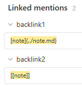
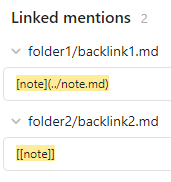

# Backlink Full Path

This is a plugin for [Obsidian](https://obsidian.md/) that shows the backlink's full path in the backlinks panel.

By default, Obsidian just shows the note name



Which might be confusing when you have notes with the same name in different folders.

This plugin shows the full name helping to identify the backlinks better



## Installation

The plugin is available in [the official Community Plugins repository](https://obsidian.md/plugins?id=backlink-full-path).

### Beta versions

To install the latest beta release of this plugin (regardless if it is available in [the official Community Plugins repository](https://obsidian.md/plugins) or not), follow these steps:

1. Ensure you have the [BRAT plugin](https://obsidian.md/plugins?id=obsidian42-brat) installed and enabled.
2. Click [Install via BRAT](https://intradeus.github.io/http-protocol-redirector?r=obsidian://brat?plugin=https://github.com/mnaoumov/obsidian-backlink-full-path).
3. An Obsidian pop-up window should appear. In the window, click the `Add plugin` button once and wait a few seconds for the plugin to install.

## Debugging

By default, debug messages for this plugin are hidden.

To show them, run the following command:

```js
window.DEBUG.enable('backlink-full-path');
```

For more details, refer to the [documentation](https://github.com/mnaoumov/obsidian-dev-utils/blob/main/docs/debugging.md).

## Support

<a href="https://www.buymeacoffee.com/mnaoumov" target="_blank"></a>

## License

© [Michael Naumov](https://github.com/mnaoumov/)
