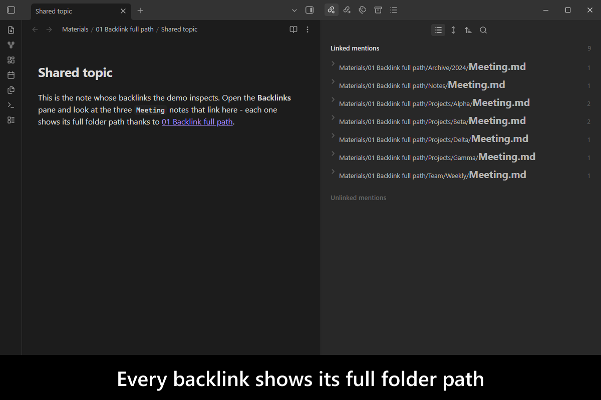
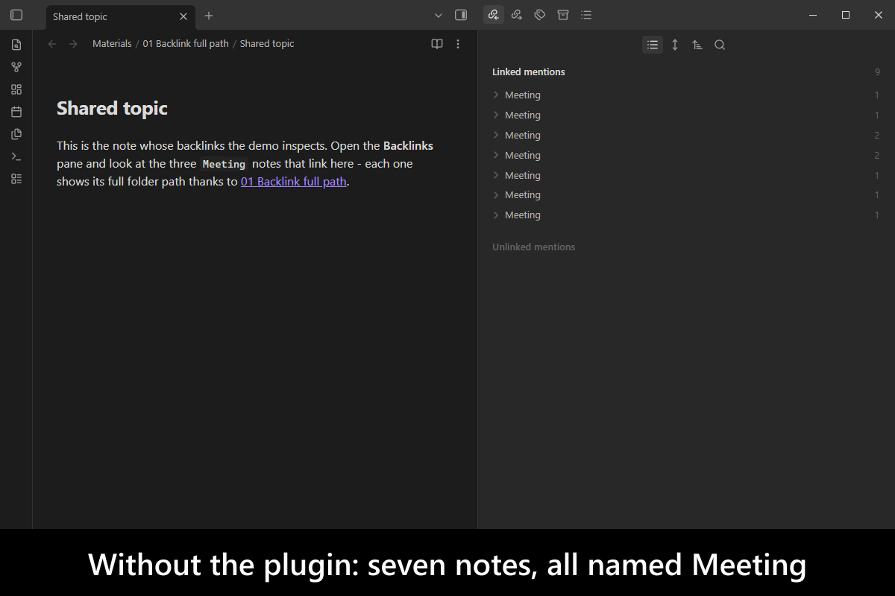
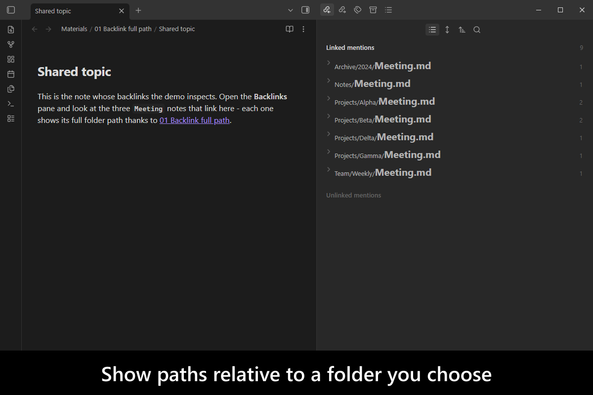
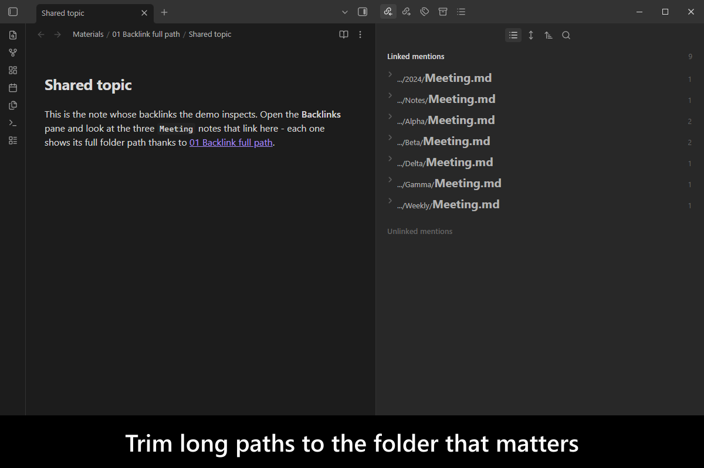
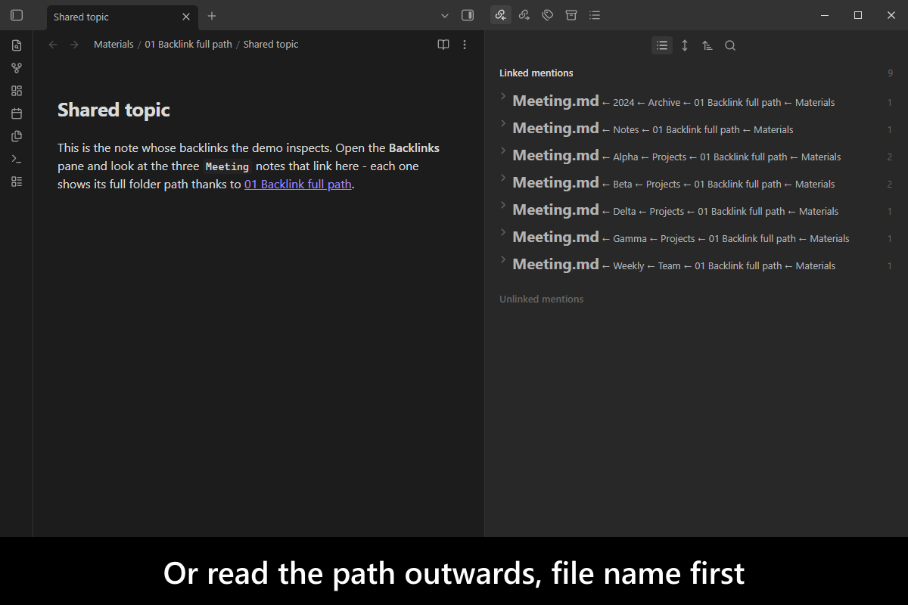
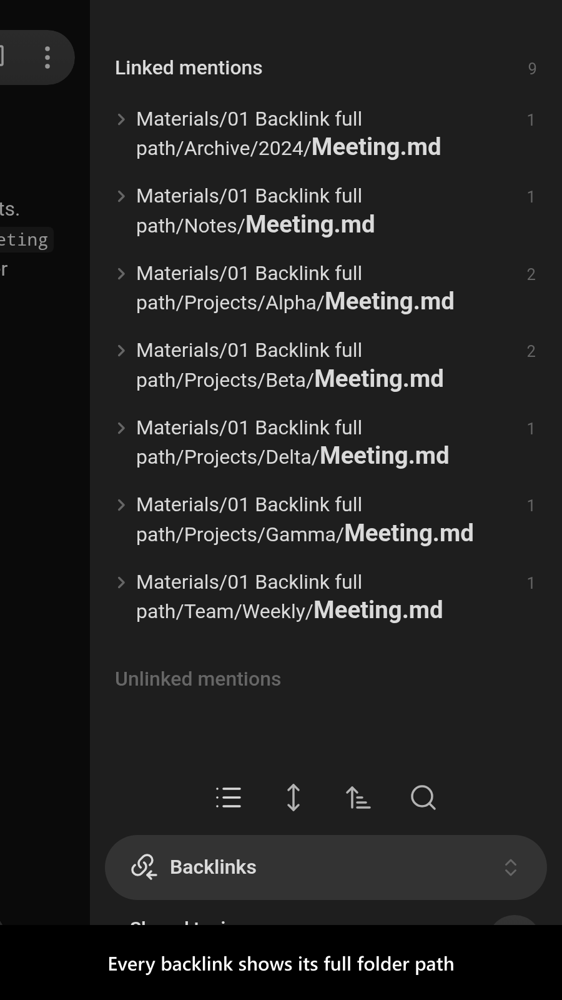
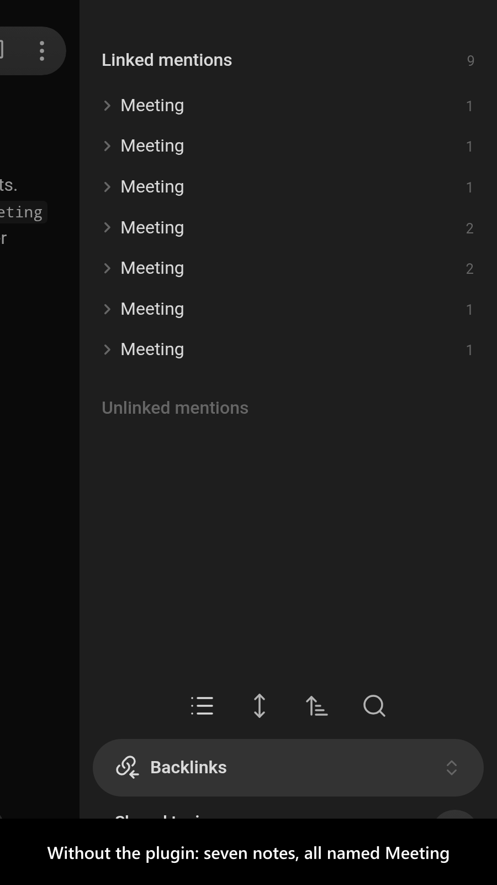
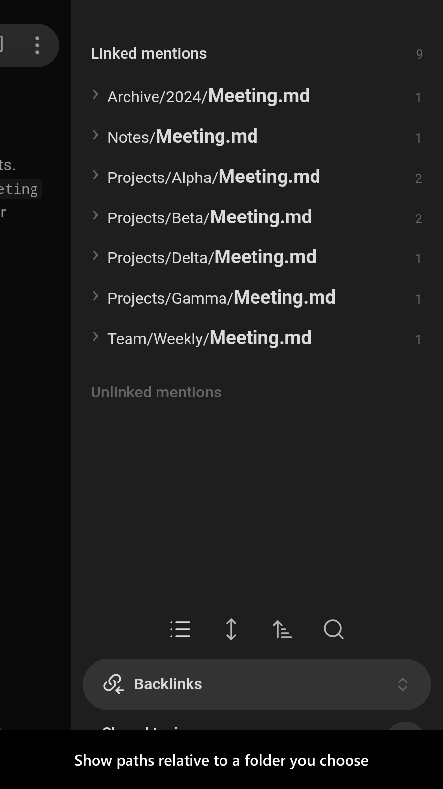
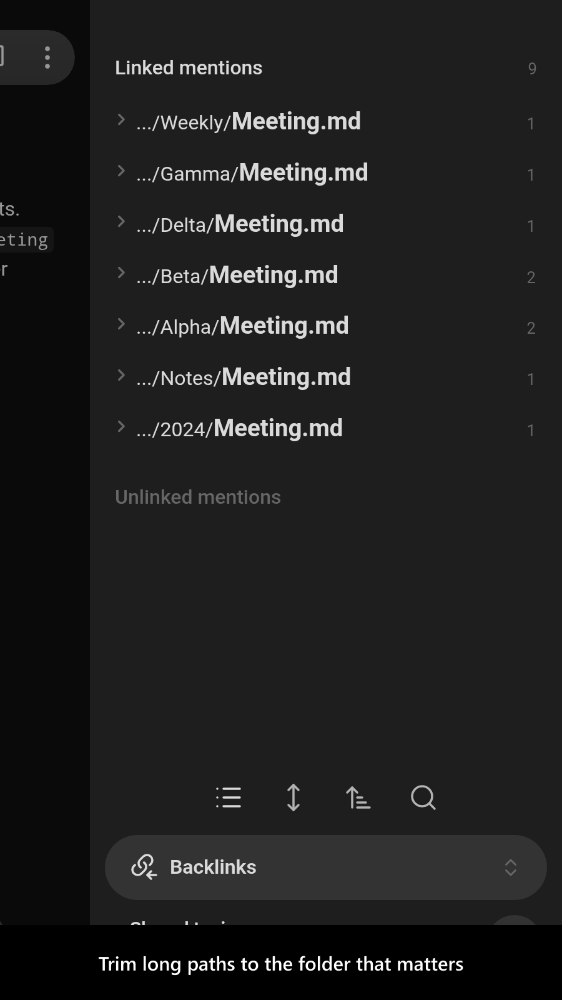
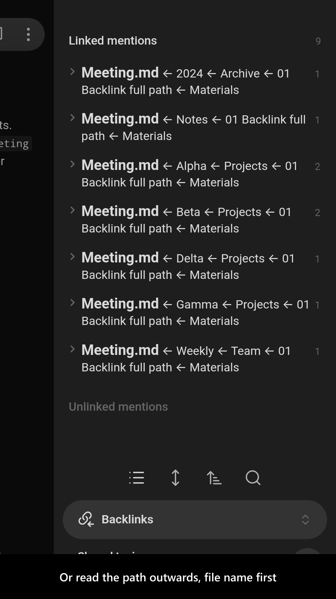

# Backlink Full Path

[](https://www.buymeacoffee.com/mnaoumov) [](https://github.com/mnaoumov/obsidian-backlink-full-path/releases) [](https://github.com/mnaoumov/obsidian-backlink-full-path/releases) [](https://github.com/mnaoumov/obsidian-backlink-full-path)

[Obsidian](https://obsidian.md/)'s Backlinks pane lists each backlink by note name alone. If you keep a `Meeting` note in three different project folders — which is the natural way to organize them — the pane shows three identical rows and no way to tell which is which without opening each one.

This plugin shows each backlink's **full path** instead, so the list identifies its notes.

<!-- markdownlint-disable MD033 -->

<a href="https://github.com/mnaoumov/obsidian-backlink-full-path/blob/HEAD/images/screenshots/screenshot-desktop-1.png"></a>

<details>
<summary>More screenshots</summary>

<div>
<a href="https://github.com/mnaoumov/obsidian-backlink-full-path/blob/HEAD/images/screenshots/screenshot-desktop-2.png"></a>
<a href="https://github.com/mnaoumov/obsidian-backlink-full-path/blob/HEAD/images/screenshots/screenshot-desktop-3.png"></a>
<a href="https://github.com/mnaoumov/obsidian-backlink-full-path/blob/HEAD/images/screenshots/screenshot-desktop-4.png"></a>
<a href="https://github.com/mnaoumov/obsidian-backlink-full-path/blob/HEAD/images/screenshots/screenshot-desktop-5.png"></a>
<a href="https://github.com/mnaoumov/obsidian-backlink-full-path/blob/HEAD/images/screenshots/screenshot-mobile-1.png"></a>
<a href="https://github.com/mnaoumov/obsidian-backlink-full-path/blob/HEAD/images/screenshots/screenshot-mobile-2.png"></a>
<a href="https://github.com/mnaoumov/obsidian-backlink-full-path/blob/HEAD/images/screenshots/screenshot-mobile-3.png"></a>
<a href="https://github.com/mnaoumov/obsidian-backlink-full-path/blob/HEAD/images/screenshots/screenshot-mobile-4.png"></a>
<a href="https://github.com/mnaoumov/obsidian-backlink-full-path/blob/HEAD/images/screenshots/screenshot-mobile-5.png"></a>
</div>

</details>

<!-- markdownlint-enable MD033 -->

## Demo vault

**The documentation is a demo vault.** Every feature has a note that explains what it does and why you would want it, with three same-named notes already in place so the ambiguity is in front of you.

**[Start reading here](<./demo-vault/00 Start.md>)** — it is plain markdown, so it works on GitHub with nothing installed.

A copy of the vault ships with every release. You can access it via any of the following:

1. Running the **Backlink Full Path: Open demo vault** command.
2. Downloading `backlink-full-path-demo-vault-<version>.zip` (`<version>` is the release version) from the [Releases](https://github.com/mnaoumov/obsidian-backlink-full-path/releases).
3. Browsing its source in [`demo-vault/`](./demo-vault/README.md) in this repository.

## What it does

- **Full paths in the Backlinks pane**, so notes sharing a name are distinguishable — shown side by side with Obsidian's default. [01 Backlink full path](<./demo-vault/01 Backlink full path.md>)
- **Every setting**, by the key it is stored under. [02 Settings](<./demo-vault/02 Settings.md>)

## Installation

The plugin is available in [the official Community Plugins repository](https://obsidian.md/plugins?id=backlink-full-path).

### Beta versions

To install the latest beta release of this plugin (regardless if it is available in [the official Community Plugins repository](https://obsidian.md/plugins) or not), follow these steps:

1. Ensure you have the [BRAT plugin](https://obsidian.md/plugins?id=obsidian42-brat) installed and enabled.
2. Click [Install via BRAT](https://intradeus.github.io/http-protocol-redirector?r=obsidian://brat?plugin=https://github.com/mnaoumov/obsidian-backlink-full-path).
3. An Obsidian pop-up window should appear. In the window, click the `Add plugin` button once and wait a few seconds for the plugin to install.

## Debugging

By default, debug messages for this plugin are hidden.

To show them, run the following command:

```js
window.DEBUG.enable('backlink-full-path');
```

For more details, refer to the [documentation](https://mnaoumov.dev/obsidian-dev-utils/guides/debugging/).

## Changelog

All notable changes to this project will be documented in the [CHANGELOG](./CHANGELOG.md).

## Contributing

Contributions are welcome — see [CONTRIBUTING](./CONTRIBUTING.md) to get set up.

## Support

<!-- markdownlint-disable MD033 -->

<a href="https://www.buymeacoffee.com/mnaoumov" target="_blank"></a>

<!-- markdownlint-enable MD033 -->

## My other Obsidian resources

[See my other Obsidian resources](https://github.com/mnaoumov/obsidian-resources).

## License

© [Michael Naumov](https://github.com/mnaoumov/)
